# Carbon-Sense

> **A gamified carbon footprint tracking platform** that empowers users to monitor, reduce, and compete on their environmental impact through intelligent task personalization, real-time feedback, and community engagement.

## 🌱 Project Overview

Carbon-Sense is a comprehensive environmental impact tracking system that combines **gamification**, **machine learning**, and **community dynamics** to help users understand and reduce their carbon footprint. The platform provides personalized daily tasks, badges for achievements, streaks for consistency, and leaderboards for social engagement.

### Core Features
- 📊 **Daily Carbon Tracking** - Real-time emission monitoring across transport, food, electricity, and eco-actions
- 🎯 **Personalized Tasks** - ML-driven daily tasks adapted to user behavior and emission patterns
- 🏆 **Badge System** - Unlock achievements across multiple categories (eco-action, emissions reduction, awareness, performance, streaks)
- 🔥 **Streak System** - Maintain consecutive app open streaks with milestone rewards
- 🥇 **Leaderboard** - Compete globally and locally on emissions reduction percentage
- 📈 **Performance Analytics** - Baseline tracking, emission trends, and reduction metrics

---

## 🏗️ System Architecture

### High-Level Flow Diagram

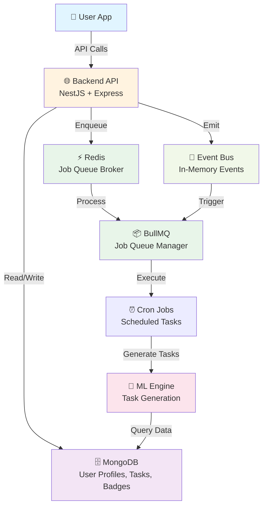

---

## 🎯 Module Architecture

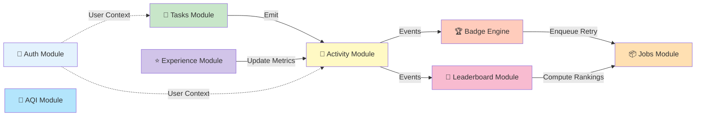

--- 

## 🎯 Task System

### Task Generation Flow

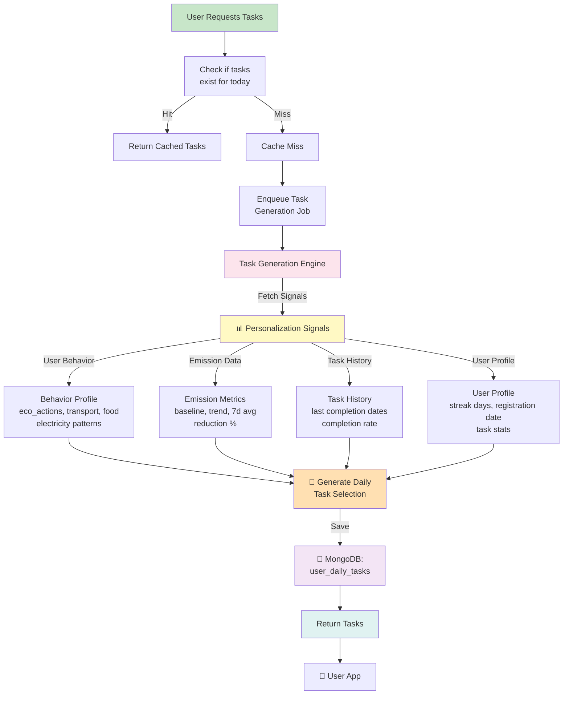

### Task Categories & Completion Types

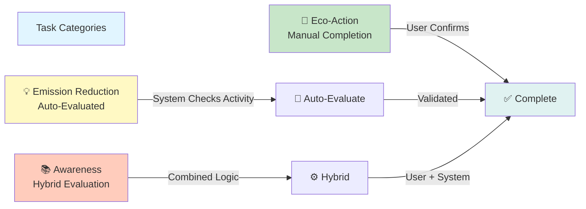

### Personalization Signals Details

```mermaid
graph TD
    PS["Personalization Signals"]
    
    BP["Behavior Profile"]
    BP -->|7-day logs| BP1["Eco-Actions Frequency"]
    BP -->|7-day logs| BP2["Transport Mode Distribution"]
    BP -->|7-day logs| BP3["Food Choices"]
    BP -->|7-day logs| BP4["Electricity Usage"]
    
    EM["Emission Metrics"]
    EM -->|Historical data| EM1["Baseline Emission"]
    EM -->|90-day records| EM2["Emission Trend"]
    EM -->|7-day average| EM3["Current Avg Emission"]
    EM -->|Performance calc| EM4["Reduction Percentage"]
    
    TH["Task History"]
    TH -->|120-day history| TH1["Last Completion Date"]
    TH -->|All tasks| TH2["Completion Rate"]
    TH -->|Yesterday tasks| TH3["Task Diversity"]
    
    UP["User Profile"]
    UP -->|Engagement| UP1["Streak Days"]
    UP -->|Registration| UP2["User Age"]
    UP -->|Stats| UP3["Category Counts"]
    
    style PS fill:#e8eaf6
    style BP fill:#c5e1a5
    style EM fill:#ffe0b2
    style TH fill:#ffccbc
    style UP fill:#d1c4e9
```

---  

## 🏆 Badge System

### Badge Evaluation Flow

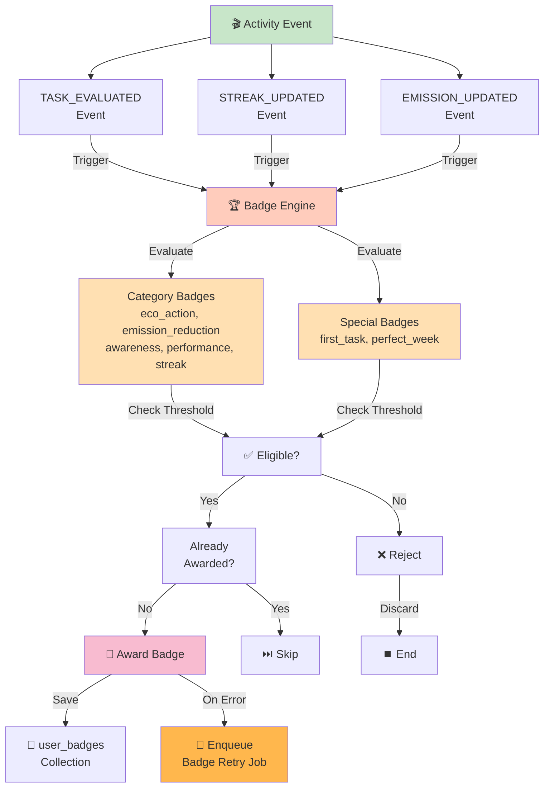

### Badge Categories & Thresholds

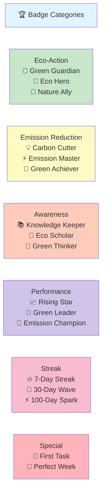

---  

## 🔥 Streak System

### Streak Tracking Flow

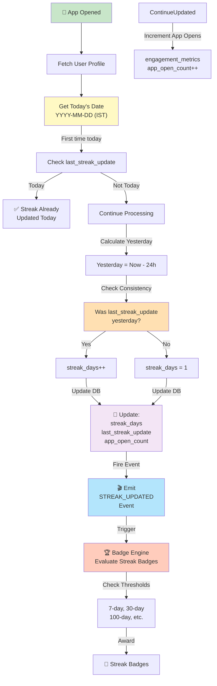

### Streak State Machine

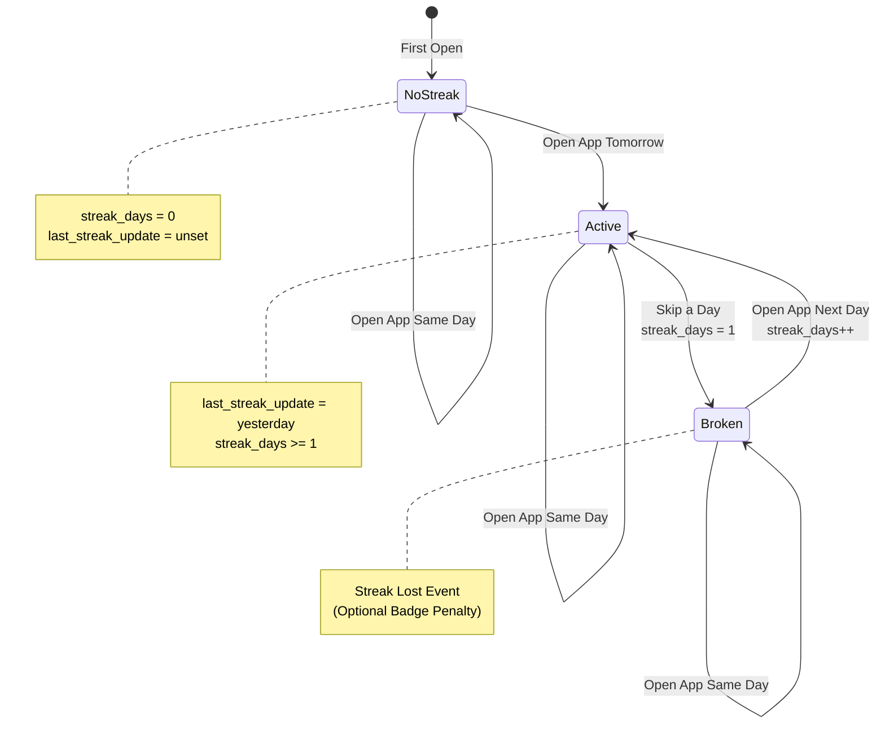

---  

## 🥇 Leaderboard System

### Leaderboard Computation Flow

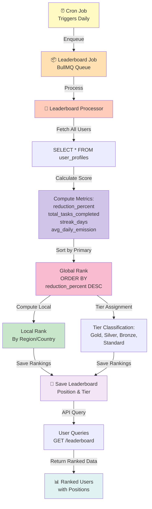

### Leaderboard Ranking Criteria

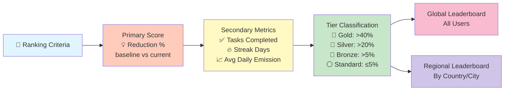

---  

## 📥 Input & Activity Tracking

### User Activity Submission Flow

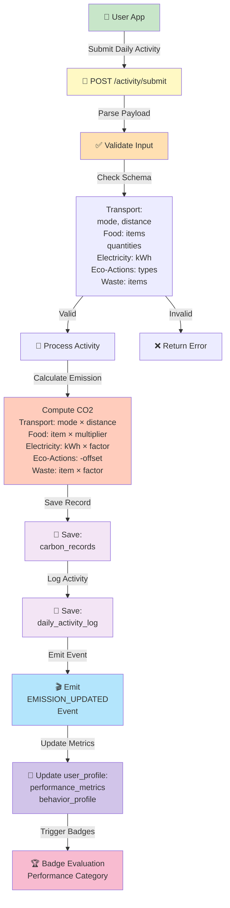

### Activity Data Schema

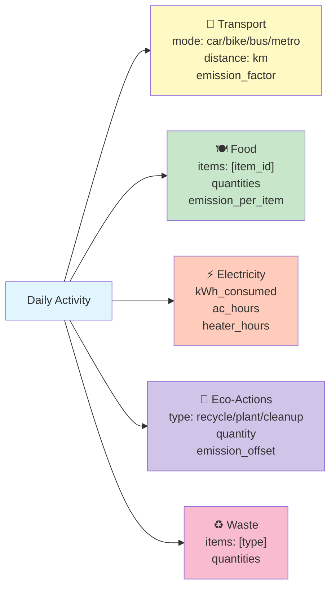

---  

## ⏰ Cron Jobs & Background Processing

### Cron Job Architecture

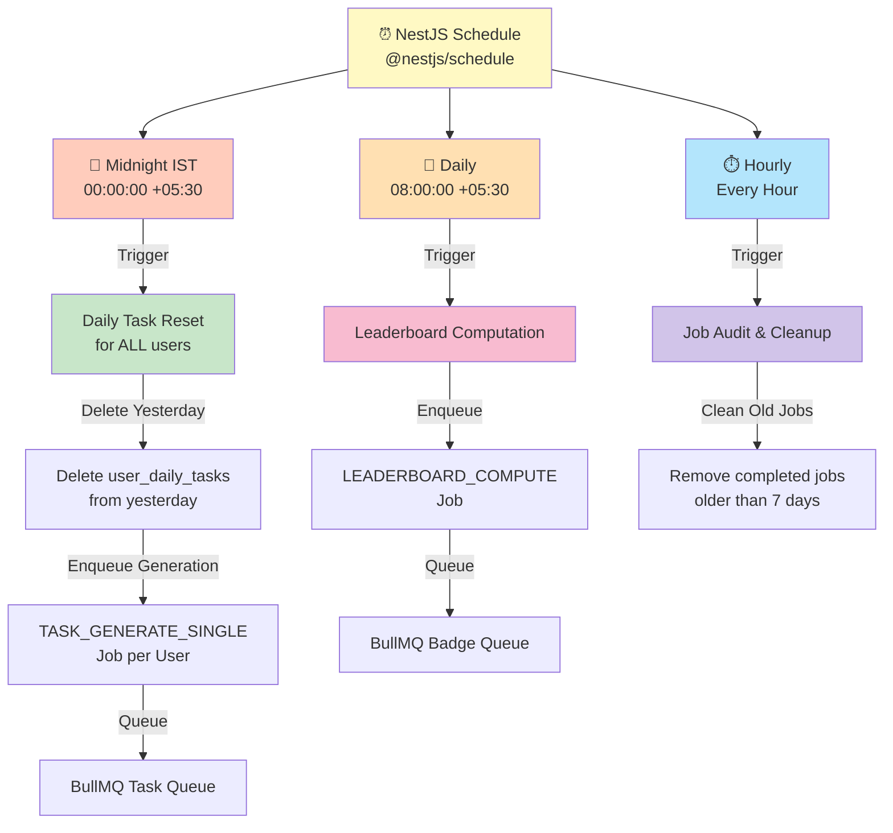

### Daily Task Reset Cron Job

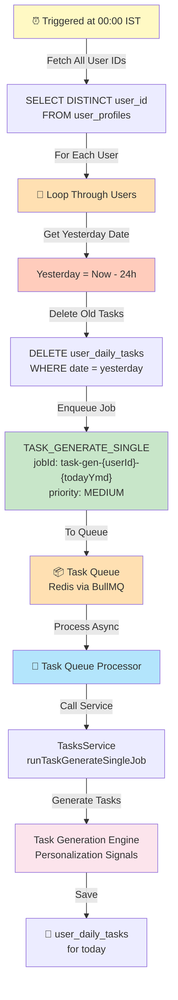

### Leaderboard Cron Job

```mermaid
graph TD
    CronTrigger["⏰ Triggered at 08:00 IST<br/>Daily"]
    
    CronTrigger -->|Enqueue| EnqueueJob["LEADERBOARD_COMPUTE<br/>Job"]
    
    EnqueueJob -->|To Queue| Queue["📦 Badge/Leaderboard Queue<br/>BullMQ"]
    
    Queue -->|Process| Processor["🔄 Leaderboard Processor"]
    
    Processor -->|Fetch All Users| FetchUsers["SELECT * FROM user_profiles<br/>with performance_metrics"]
    
    FetchUsers -->|For Each User| CalcMetrics["Calculate:<br/>reduction_percent<br/>total_tasks_completed<br/>streak_days<br/>avg_daily_emission<br/>badges_count"]
    
    CalcMetrics -->|Sort Globally| GlobalRank["RANK() OVER<br/>ORDER BY reduction_percent DESC"]
    
    GlobalRank -->|Sort by Region| RegionalRank["RANK() OVER PARTITION BY<br/>region"]
    
    RegionalRank -->|Assign Tier| AssignTier["IF reduction_percent >= 40<br/>THEN tier = Gold<br/>ELSE IF reduction_percent >= 20<br/>THEN tier = Silver<br/>... etc"]
    
    AssignTier -->|Bulk Update| BulkUpdate["💾 BULK UPDATE leaderboard<br/>SET rank, regional_rank,<br/>tier, last_computed"]
    
    BulkUpdate -->|Complete| Done["✅ Leaderboard Updated<br/>Ready for API Queries"]
    
    style CronTrigger fill:#fff9c4
    style EnqueueJob fill:#ffe0b2
    style Queue fill:#ffccbc
    style Processor fill:#c8e6c9
    style CalcMetrics fill:#d1c4e9
    style GlobalRank fill:#f8bbd0
    style RegionalRank fill:#b3e5fc
    style AssignTier fill:#ffb3ba
    style BulkUpdate fill:#f3e5f5
    style Done fill:#c8e6c9
```

---  

## 🤖 ML Service & Task Generation Engine

### ML-Driven Task Personalization

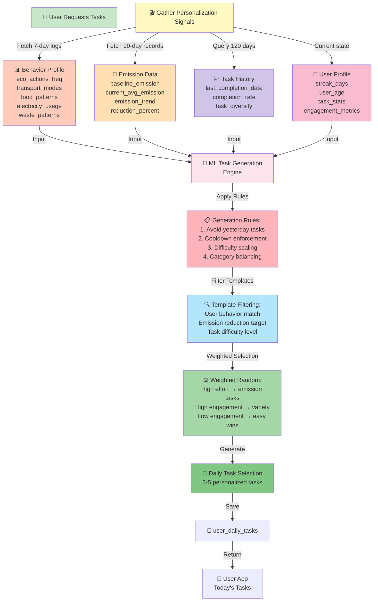

### Task Generation Logic: Personalization Signals

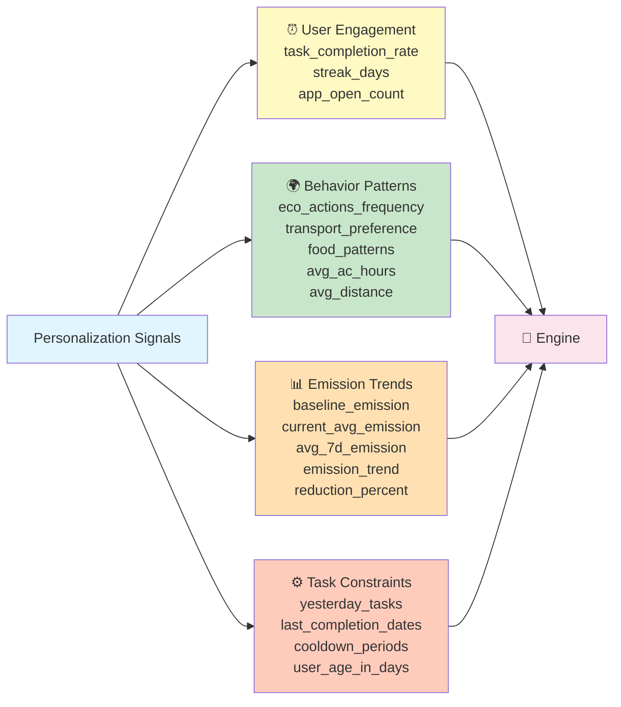

### Task Complexity & Difficulty Scaling

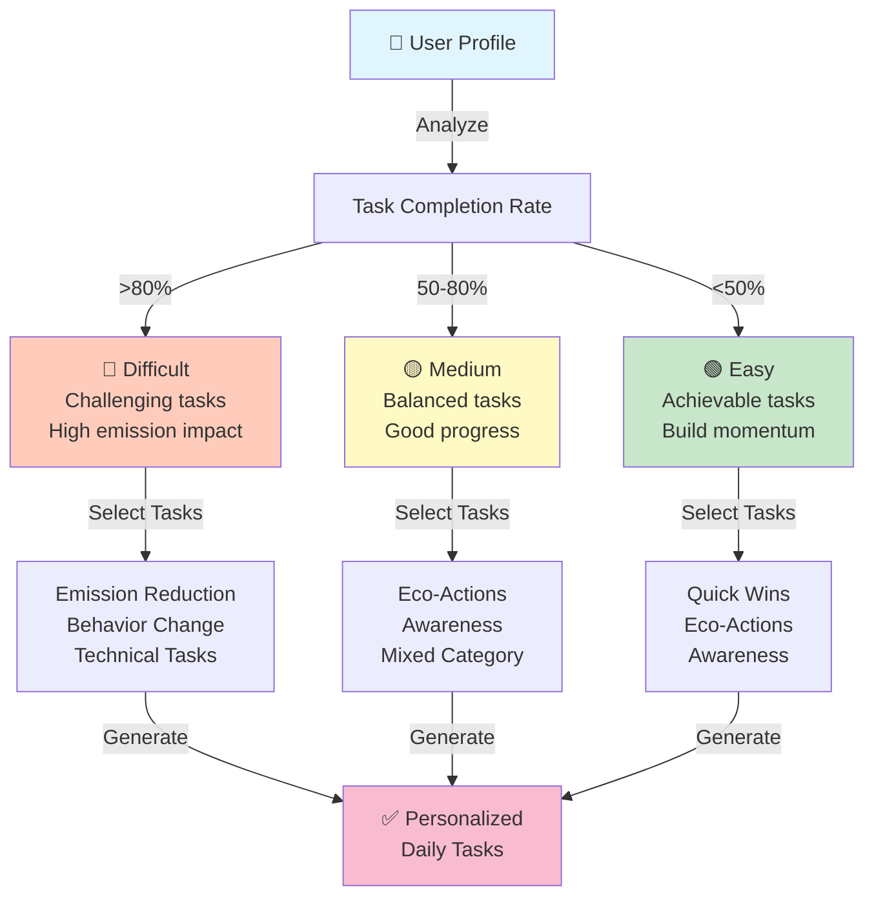

---  

## 💾 Data Models

### User Profile Schema Highlights

```
UserProfile {
  _id: ObjectId
  user_id: ObjectId → User
  
  streak_days: Number (default: 0)
  last_streak_update: String (YYYY-MM-DD)
  
  task_stats: {
    eco_action: Number
    emission_reduction: Number
    awareness: Number
  }
  
  engagement_metrics: {
    app_open_count: Number
    total_tasks_completed: Number
    task_completion_rate: Number (0-1)
  }
  
  performance_metrics: {
    baseline_emission: Number
    current_avg_emission: Number
    reduction_percent: Number (0-100)
  }
  
  behavior_profile: {
    avg_ac_hours: Number
    avg_distance: Number
    eco_actions_frequency: Number
    transport_modes: Map
    food_preferences: Map
  }
  
  weekly_insights: {
    primary_transport: String
    primary_food_category: String
    high_emission_period: String
  }
  
  created_at: Date
  updated_at: Date
}
```

### Event-Driven Architecture

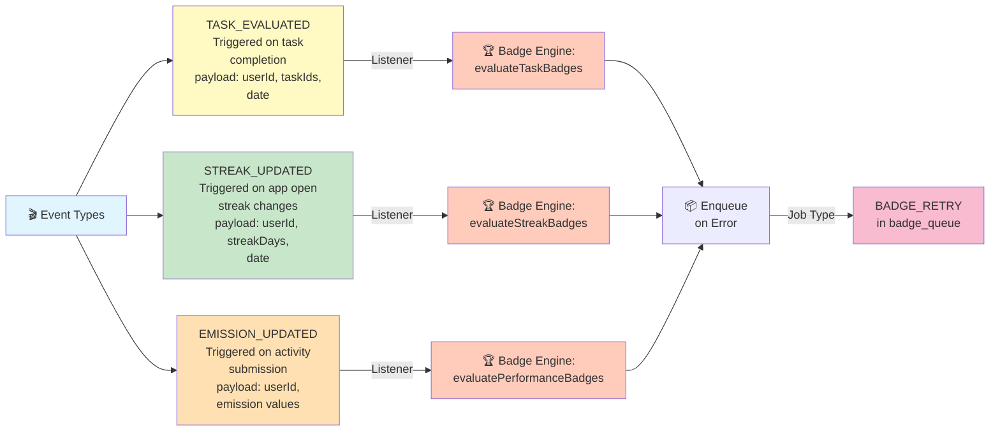

---  

## 📦 Job Queue Architecture

### BullMQ Queue Overview

```mermaid
graph TD
    Redis["⚡ Redis<br/>Message Broker"]
    
    TaskQueue["📋 Task Queue<br/>task_queue"]
    BadgeQueue["🏆 Badge Queue<br/>badge_queue"]
    LeaderQueue["🥇 Leaderboard Queue<br/>leaderboard_queue"]
    
    Redis --> TaskQueue
    Redis --> BadgeQueue
    Redis --> LeaderQueue
    
    TaskQueue -->|Jobs| TJ1["TASK_GENERATE_SINGLE<br/>Generate daily tasks<br/>Priority: MEDIUM"]
    
    BadgeQueue -->|Jobs| BJ1["BADGE_RETRY<br/>Retry failed badge evaluation<br/>Priority: LOW"]
    
    LeaderQueue -->|Jobs| LJ1["LEADERBOARD_COMPUTE<br/>Compute rankings<br/>Priority: MEDIUM"]
    
    TJ1 -->|Processor| TP["task-queue.processor"]
    BJ1 -->|Processor| BP["badge-retry.processor"]
    LJ1 -->|Processor| LP["leaderboard.processor"]
    
    TP -->|Calls| TS["TasksService"]
    BP -->|Calls| BE["BadgeEngineService"]
    LP -->|Calls| LC["LeaderboardComputationService"]
    
    TS -->|Update| DB[(MongoDB)]
    BE -->|Update| DB
    LC -->|Update| DB
    
    style Redis fill:#e8f5e9
    style TaskQueue fill:#fff9c4
    style BadgeQueue fill:#ffccbc
    style LeaderQueue fill:#ffe0b2
    style TJ1 fill:#c8e6c9
    style BJ1 fill:#f8bbd0
    style LJ1 fill:#d1c4e9
    style TP fill:#b3e5fc
    style BP fill:#ffb3ba
    style LP fill:#a5d6a7
    style DB fill:#f3e5f5
```

---  

## 🔄 Error Handling & Resilience

### Resilience Strategy

```mermaid
graph TD
    Error["❌ Error Occurs"]
    
    ErrorType{{"Error Type?"}}
    
    Error --> ErrorType
    
    ErrorType -->|CRITICAL| CritLog["🔴 Critical Log"]
    CritLog -->|Log to DB| ErrDB["error_logs<br/>Collection"]
    ErrDB -->|Alert| Admin["📧 Admin Alert"]
    
    ErrorType -->|NON_CRITICAL| NonCritLog["🟡 Non-Critical Log"]
    NonCritLog -->|Log to DB| ErrDB2["error_logs<br/>Collection"]
    ErrDB2 -->|Retry Queue?| RetryDecision{{"Has Retry Logic?"}}
    
    RetryDecision -->|Yes| Enqueue["📦 Enqueue<br/>Retry Job"]
    RetryDecision -->|No| Silent["Silent Fail<br/>w/ Logging"]
    
    Enqueue -->|Configure| RetryPolicy["Retry Policy:<br/>exponential backoff<br/>max 3 retries<br/>1min, 5min, 15min"]
    
    RetryPolicy -->|Retry| Attempt["🔄 Attempt Again"]
    Attempt -->|Success| Resolved["✅ Resolved"]
    Attempt -->|Fail Max| FinalFail["❌ Final Failure<br/>Log & Alert"]
    
    style Error fill:#ffcccc
    style ErrorType fill:#ffb3ba
    style CritLog fill:#ef5350
    style NonCritLog fill:#ffa726
    style Enqueue fill:#29b6f6
    style Attempt fill:#66bb6a
    style Resolved fill:#ab47bc
    style FinalFail fill:#d32f2f
```

---  

## 📊 API Endpoints Summary

| Endpoint | Method | Purpose |
|----------|--------|---------|
| `/tasks/today` | GET | Get today's personalized tasks |
| `/tasks/complete` | POST | Mark task as completed |
| `/tasks/evaluate` | POST | Evaluate awareness tasks |
| `/activity/submit` | POST | Submit daily activity |
| `/badges` | GET | Get user's badges |
| `/leaderboard` | GET | Get global/regional leaderboard |
| `/profile` | GET | Get user profile & metrics |
| `/streak` | GET | Get streak information |

---  

## 🛠️ Technology Stack

### Backend
- **Framework**: NestJS (TypeScript)
- **Database**: MongoDB with Mongoose ODM
- **Job Queue**: BullMQ (with Redis backend)
- **Scheduling**: @nestjs/schedule (cron)
- **Authentication**: JWT with Passport
- **Validation**: class-validator, class-transformer
- **File Upload**: Cloudinary
- **Error Tracking**: ErrorLogService

### Deployment Infrastructure
- **Runtime**: Node.js
- **Port**: 3000 (default)
- **Environment Variables**: 
  - `MONGODB_URI`
  - `REDIS_URL`
  - `JWT_SECRET`
  - `CLOUDINARY_*`

---  

## 🚀 Getting Started

### Prerequisites
- Node.js >= 18
- MongoDB >= 5.0
- Redis >= 6.0

### Installation

```bash
# Navigate to backend
cd backend

# Install dependencies
npm install

# Seed database (optional)
npm run seed

# Development
npm run start:dev

# Production build
npm run build
npm run start:prod
```

### Environment Setup

Create `.env` file:

```env
MONGODB_URI=mongodb://localhost:27017/carbonsense
REDIS_URL=redis://localhost:6379
JWT_SECRET=your-secret-key
NODE_ENV=development
DISABLE_BULLMQ=false
```

---  

## 📈 Key Metrics & KPIs

- **Task Completion Rate** - % of assigned tasks completed
- **Streak Consistency** - Average user streak days
- **Emission Reduction** - % improvement vs baseline
- **Badge Achievement** - Avg badges per user
- **Daily Active Users** - App open frequency
- **Leaderboard Engagement** - Users viewing rankings

---  

## 🔮 Future Enhancements

- [ ] AI-powered task difficulty auto-adjustment
- [ ] Social features (friend challenges, team competitions)
- [ ] Real-time AQI integration for location-based tasks
- [ ] Mobile push notifications for streaks/badges
- [ ] Carbon credit marketplace
- [ ] Integration with wearables (fitness tracking)
- [ ] ML-based carbon offset recommendations

---  

## 📝 Contributing

1. Fork the repository
2. Create feature branch: `git checkout -b feature/amazing-feature`
3. Commit changes: `git commit -m 'Add amazing feature'`
4. Push to branch: `git push origin feature/amazing-feature`
5. Open a Pull Request

---  

## 📄 License

This project is licensed under the MIT License - see LICENSE file for details.

---  

## 👨‍💻 Author

**Pushkar GB** - [@PushkarGB](https://github.com/PushkarGB)

---  

## 🙏 Acknowledgments

- NestJS community for excellent framework
- BullMQ for robust job queue
- MongoDB for flexible data modeling
- All contributors and testers

---

**Made with 💚 for the planet** 🌍